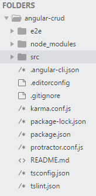
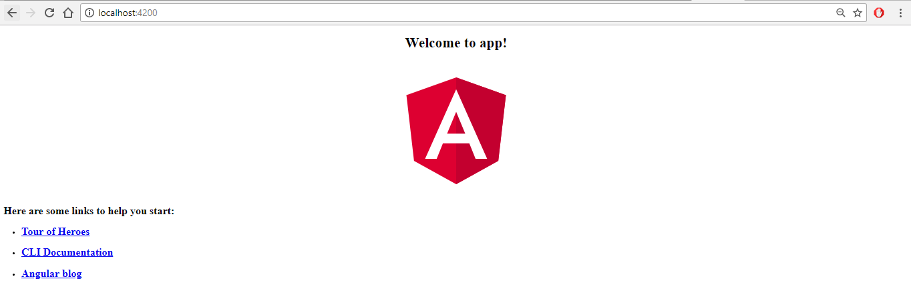
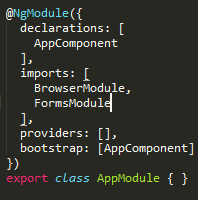
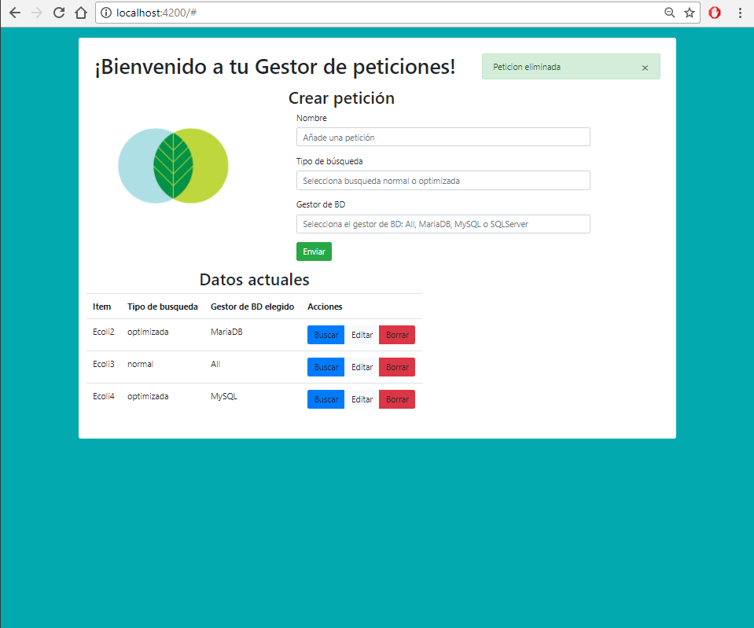
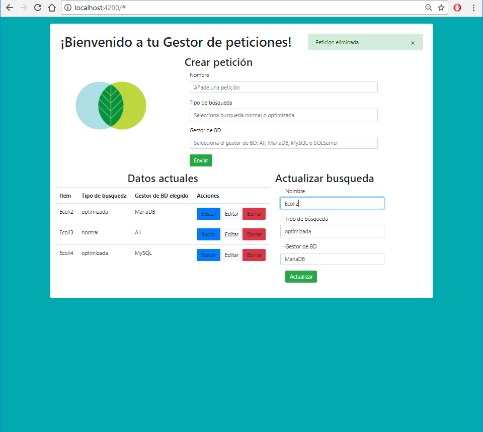

```{r setup, include=FALSE}
knitr::opts_chunk$set(echo = TRUE)
```


Lo primero que tenemos que hacer es instalar Angular, para ello tenemos primero que tener instalado npm ````npm install -g @angular/cli````.

Después ya podemos crear nuestro primer proyecto en Angular. Para este tutorial vamos a implementar una interfaz CRUD *(Create-Read-Update-Delete)*. Para crear un proyecto nuevo ejecutamos: ````ng new angular-crud ```` *(angular-crud = Nombre del proyecto)*.

Esto nos va a crear una carpeta con todas las dependencias de *Angular* y las dependencias de *npm*. Abrimos el proyecto en el editor de código y debemos tener lo siguiente:



Ahora vamos a probar a ejecutar para comprobar que salida obtenemos. Para ello ejecutaremos en la terminal el comando ````ng serve````.

Si abrimos ahora **localhost** en el puerto *4200*, podemos ver lo siguiente:




Vamos a empezar importando las librerías que necesitamos para escribir los formularios con Angular. Entonces, nos vamos a ir a */src/app/app.module.ts*. Concretamente vamos a importar **FormsModule** tal que así: ````import{FormsModule} from '@angular/forms'; ````. Después tendremos que añadir a los imports el **FormsModule**.



A continuación vamos a incluir **Bootstrap**. Para ello ejecutaremos dentro de la teminar ````npm i bootstrap --save````. Esto instalará dentro de nuestra carpeta *node modules* --> **bootstrap** que es donde tenemos todas las dependencias. 

Cuando acabe, podemos buscar dentro de la carpeta de **node modules** y ver que ahora tenemos una carpeta que es **Bootstrap**. Para poder usar **Bootstrap** vamos a *angular-cli.json* y añadimos en la parte de styles **Bootstrap** añadiendole la ruta donde está **Bootstrap**. La ruta que tenemos que añadir es ````"../node_modules/bootstrap/dist/css/bootstrap.min.css"````. 

```
 "styles": [
        "../node_modules/bootstrap/dist/css/bootstrap.min.css",
        "styles.css"
      ],
      
```

Con esto ya tenemos en **Bootstrap** instalado. Para comprobarlo, vamos a ejecutar nuestra aplicación con el comando que hemos probado anteriormente.````ng serve````podremos correr otra vez el servidor y es el momento de ir al script *app.component.html*, que es donde pondremos la estructura en **HTML** que va a tener nuestra aplicación.

#Cambios en la interfaz

Como es natural podemos modificar el *app.component.hmtl* como queramos. Sabemos que Angular se basa en POO, y estos objetos podemos definirlos en el script de *app.component.ts*. Definimos el título como un tipo string ````title:string = 'Gestor de peticiones';````. 

Para este ejemplo vamos a trabajar con peticiones, así que vamos a definir un objetos para estos. 

````
petition =[
  {'name': 'Ecoli', searchtype: 'normal', DBgestor : 'SQLServer'},
  {'name': 'Ecoli1', searchtype: 'optimal', DBgestor : 'All'},
  {'name': 'Ecoli2', searchtype: 'optimal', DBgestor : 'MariaDB'},
  {'name': 'Ecoli3', searchtype: 'normal', DBgestor : 'All'},
  {'name': 'Ecoli4', searchtype: 'optimal', DBgestor : 'MySQL'}
];
````

Como estamos haciendo una CRUD, vamos a definir además algunos métodos aqui. Como por ejemplo, añadir petición.

````
addPetition():void{
  
}

deletePetition():void{

}

editPetition():void{

}

updatePetition():void{

}
````

Vamos a crear un modelo con: ````model:any ={};````, que se va a encargar básicamente de actualizar nuestros datos. 

Una vez guardado todo esto podemos pasar al *HTML*. Implementamos la interfaz que elijamos. El ejemplo de la una tabla me parece bastante representativo sobre como llamar a los métodos y los posibles valores del modelo.

```
<table class="table">
           <thead>
             <tr>
               <th>Item</th>
               <th>Tipo de busqueda</th>
               <th>Gestor de BD elegido</th>
               <th>Acciones</th>
             </tr>
           </thead>
           <tbody>
             <tr *ngFor="let petit of petition; let i = index "> // Hace las veces de bucle
             
             --llamamos a los valores--
               <td>{{petit.name}}</td> 
               <td>{{petit.searchtype}}</td>
               <td>{{petit.DBgestor}}</td>
               <td>

            --llamamos a las funciones--
                <div class="btn-group">
                 <a (click)="deletePetition(i)" class="btn btn-primary">
                   Buscar
                 </a>
            
                   <a (click)="editPetition(i)" class="btn btn-light">
                     Editar

                   </a>

                   <a (click)="deletePetition(i)" class="btn btn-danger">
                     Borrar
                   </a>
          
                </div>

               </td>
             </tr>
           </tbody>
         </table>
```

*Por último pasamos a ver cómo se implementarían las funciones.*

Aquí definimos algunas variables. En mi caso, el título, una variable msg que utilizaba pasar ir enseñando al usuario que realizaba correctamente las funciones requeridas. Y por último un atributo booleano,  ``` <div class="col-sm-4" [hidden]="hideUpdate">```, que solo muestra lo que se encuentra dentro del **<div>** si hideUpdate == false.
```
export class AppComponent {
  title:string = 'Gestor de peticiones';
  msg:string = '';
  hideUpdate:boolean = true;
```
Definimos dos modelos. Uno, el que ya teníamos, el otro nos hace falta para poder editar las diferentes peticiones.

```
	model:any ={};
	model2:any={};
```

Pasamos finalmente a ver cómo se implementan las funciones de CRUD. Empezando por addPetition(), que con .push incluye (*this.model*) dentro de la lista de peticiones. Tenemos otra sentencia que nos sirve para mostrar un mensaje que muestra que la petición se ha añadido correctamente.

```
	addPetition():void{
	  this.petition.push(this.model);

	  this.msg='Peticion añadida';
	}
```
A continuación nos encontramos con deletePetition(i). En primer lugar guardamos en una variable el resultado de confirm(*Pregunta*). If(answer), es decir, si answer == true, utilizamos el .splice(i, 1) para eliminar la petición. Y finalmente mostramos el mensaje de petición eliminada correctamente. 
```

	deletePetition(i):void{
		

		var answer = confirm('¿Seguro que quiere eliminar la peticion?');

		console.log(answer);

		if(answer){
			this.petition.splice(i, 1);
		}
		

		this.msg='Peticion eliminada';
	}
```

EditPetition(i), nos va a servir para cambiar los valores de una determinada petición y guardarlos en otro modelo. Lo primeroes definir una variable que es donde guardaremos el índice y hacer visible la ventana pra editar los datos. Solo quedará guardar los valores en el model2 que habíamos definido anteriormente. 

```
	myValue;
	editPetition(i):void{
		this.hideUpdate=false;
		this.model2.name=this.petition[i].name;
		this.model2.searchtype=this.petition[i].searchtype;
		this.model2.DBgestor=this.petition[i].DBgestor;
		this.myValue = i;
	}
	
```
Finalmente tenemos updatePetition() que lo que hace es coger el índice que habíamos guardado antes para recorrer las peticiones hasta encontrar ese índice. En ese momento machaca los valores de la lista de peticiones con los valores de model2. Además guardamos en msg que se ha actualizado correctamente y volvemos a hacer invisible el componente.

```
	updatePetition():void{
		let i =this.myValue;
		for(let j =0 ;j< this.petition.length;j++){
			if(i == j){
				this.petition[i]=this.model2;
				this.model2={};
			}
		}
		this.msg='Peticion actualizada';
		this.hideUpdate=true;
	}
	
```


Mi CRUD quedó tal que así:





